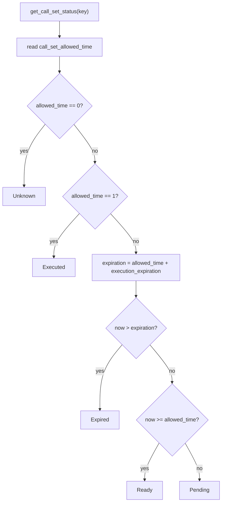
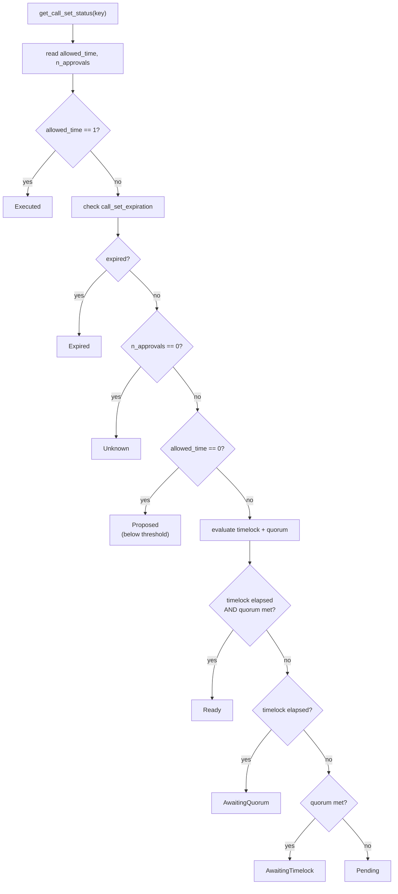

# Delayed Executor -- Implementation Guide

## 1. Module Structure

```
packages/delayed_executor/
  Scarb.toml                          # Package manifest
  README.md                           # Package overview
  src/
    lib.cairo                         # Root module, re-exports all sub-modules
    types.cairo                       # Constants, enums, events, errors, compute_call_set_key utility
    delayed_executor.cairo            # IDelayedExecutor trait + DelayedExecutor contract
    multi_owned.cairo                 # IMultiOwned trait + MultiOwnedComponent
    multi_executor.cairo              # IMultiExecutor trait + MultiExecutor contract
  tests/
    lib.cairo                         # Integration test crate root (declares the modules below)
    mocks.cairo                       # MockCounter (call target) + MockMultiOwned (component testing)
    test_delayed_executor.cairo       # DelayedExecutor integration tests
    test_multi_owned.cairo            # MultiOwnedComponent integration tests
    test_multi_executor.cairo         # MultiExecutor integration tests
  docs/
    SPEC.md                           # Specification
    IMPLEMENTATION.md                 # This file
```

## 2. Dependencies

| Dependency | Type | Purpose |
|-----------|------|---------|
| `starknet` | runtime | Core Starknet types (`ContractAddress`, `Call`, syscalls) |
| `openzeppelin` | runtime | `OwnableComponent` (two-step) and `openzeppelin::utils::execution::execute_calls` |
| `snforge_std` | dev | Test framework (deploy, cheat timestamps/callers, event spying) |
| `assert_macros` | dev | Assertion macros for tests |

All dependency versions are inherited from the workspace (`openzeppelin` 3.0.0, `starknet` 2.15.1,
`snforge_std` 0.59.0, `assert_macros` 2.15.1).

## 3. Storage Layout

### 3.1 DelayedExecutor

| Field | Type | Purpose |
|-------|------|---------|
| `ownable` | `OwnableComponent::Storage` | OZ two-step ownership (substorage) |
| `execution_delay` | `u64` | Seconds between submission and execution eligibility |
| `execution_expiration` | `u64` | Seconds of validity window after delay |
| `call_set_allowed_time` | `Map<felt252, u64>` | Call set key -> activation timestamp (0 = not submitted, 1 = executed) |

### 3.2 MultiExecutor

| Field | Type | Purpose |
|-------|------|---------|
| `multi_owned` | `MultiOwnedComponent::Storage` | Multi-owner state (substorage) |
| `execution_delay` | `u64` | Seconds between threshold and execution eligibility |
| `execution_expiration` | `u64` | Seconds from first signature to expiration |
| `quorum_size` | `u32` | Minimum approvals for execution |
| `delay_start_threshold` | `u32` | Approvals needed to start delay timer |
| `call_set_allowed_time` | `Map<felt252, u64>` | Call set key -> activation timestamp |
| `call_set_expiration` | `Map<felt252, u64>` | Call set key -> absolute expiration timestamp |
| `call_set_n_approvals` | `Map<felt252, u32>` | Call set key -> number of owner approvals |
| `call_set_approvers` | `Map<(felt252, u32), bool>` | (call set key, owner index) -> has approved |

### 3.3 MultiOwnedComponent

| Field | Type | Purpose |
|-------|------|---------|
| `n_owners` | `u32` | Total owner slots (immutable after init) |
| `acceptance_delay` | `u64` | Seconds before nominee can accept |
| `owner_to_index` | `Map<ContractAddress, u32>` | Address -> 1-based index (0 = not owner) |
| `index_to_owner` | `Map<u32, ContractAddress>` | 1-based index -> address |
| `pending_to_current` | `Map<ContractAddress, ContractAddress>` | Nominee -> owner being replaced |
| `current_to_pending` | `Map<ContractAddress, ContractAddress>` | Owner -> their nominee |
| `acceptance_time` | `Map<ContractAddress, u64>` | Nominee -> earliest acceptance timestamp |

## 4. Call Set Key Computation

Both contracts use a shared `compute_call_set_key` function defined in `types.cairo`:

```cairo
fn compute_call_set_key(calls: Span<Call>) -> felt252 {
    let mut serialized: Array<felt252> = array![];
    Serde::serialize(@calls, ref serialized);
    poseidon_hash_span(serialized.span())
}
```

`Serde::serialize` produces a deterministic flat array of `felt252` values from the calls span. Each `Call` serializes as: target address, entry point selector, calldata length, calldata elements. The Poseidon hash of this array is the call set key.

The same calls always produce the same key. Different orderings produce different keys. This is intentional -- the call set is an ordered batch.

## 5. Status Computation Logic

### 5.1 DelayedExecutor



### 5.2 MultiExecutor



## 6. Integration Guide

### 6.1 Deploying DelayedExecutor

Constructor arguments:
- `owner: ContractAddress` -- initial owner
- `execution_delay: u64` -- delay in seconds (0 to 2,419,200)
- `execution_expiration: u64` -- expiration window in seconds (3,600 to 31,449,600)

Example: 1-day delay, 1-week expiration:
```cairo
let executor = deploy(
    DelayedExecutor::TEST_CLASS_HASH,
    array![owner.into(), 86400, 604800],
);
```

### 6.2 DelayedExecutor Workflow

**Step 1: Register a call set**

```cairo
let calls = array![
    Call { to: target_address, selector: selector!("transfer"), calldata: calldata.span() },
].span();

let call_set_key = executor.submit_calls(calls);
// Status: Pending
// Event: CallSetSubmitted { call_set_key, enable_time }
```

**Step 2: Wait for delay**

```cairo
let ready_time = executor.get_call_set_ready_time(call_set_key);
// Wait until block_timestamp >= ready_time
let status = executor.get_call_set_status(call_set_key);
// Status: Ready (once delay elapses)
```

**Step 3: Execute**

```cairo
executor.exec_calls(calls);
// Status: Executed
// Event: CallSetExecuted { call_set_key }
```

**Cancellation (at any time before expiration):**

```cairo
executor.retract_call_set(call_set_key);
// Status: Unknown
// Event: CallSetRetracted { call_set_key }
```

### 6.3 Deploying MultiExecutor

Constructor arguments:
- `owners: Span<ContractAddress>` -- initial owner addresses
- `quorum_size: u32` -- approvals needed to execute
- `delay_start_threshold: u32` -- approvals needed to start timer
- `acceptance_delay: u64` -- delay for ownership transfers (0 to 1,209,600)
- `execution_delay: u64` -- execution delay (0 to 2,419,200)
- `execution_expiration: u64` -- expiration window (3,600 to 31,449,600)

### 6.4 MultiExecutor Workflow

**Step 1: Owners sign the call set**

```cairo
// Owner 1 signs (first signature starts the expiration timer)
cheat_caller_address(executor, owner1, ...);
let call_set_key = delayed_dispatcher.submit_calls(calls);
// First-signature status depends on configuration:
//   Proposed          -- threshold > 1
//   Pending           -- threshold == 1, quorum > 1, delay > 0
//   AwaitingQuorum    -- threshold == 1, quorum > 1, delay == 0
//   AwaitingTimelock  -- threshold == 1, quorum == 1, delay > 0
//   Ready             -- threshold == 1, quorum == 1, delay == 0
// Event: CallSetSignaturesUpdated { ..., SignatureAdded, n_approvals: 1 }

// Owner 2 signs (may reach threshold/quorum, advancing the state)
cheat_caller_address(executor, owner2, ...);
delayed_dispatcher.submit_calls(calls);
// Status: Pending, AwaitingTimelock, AwaitingQuorum, or Ready depending on config
```

**Step 2: Wait for delay**

```cairo
let ready_time = delayed_dispatcher.get_call_set_ready_time(call_set_key);
let status = delayed_dispatcher.get_call_set_status(call_set_key);
// Check status is Ready before executing
```

**Step 3: Any owner executes**

```cairo
delayed_dispatcher.exec_calls(calls);
// All approvals cleared, status: Executed
```

**Withdrawing approval:**

```cairo
// Owner withdraws their signature
delayed_dispatcher.retract_call_set(call_set_key);
// Event: CallSetSignaturesUpdated { ..., SignatureRemoved, ... }
```

**Clearing expired:**

```cairo
multi_dispatcher.clear_expired_call_set(call_set_key);
// Status: Unknown (can be re-submitted)
// Event: ExpiredCallSetCleared { call_set_key }
```

### 6.5 Querying Status and Approvals

```cairo
// Status
let status = delayed_dispatcher.get_call_set_status(call_set_key);

// Ready time (u64::MAX if not applicable)
let ready_time = delayed_dispatcher.get_call_set_ready_time(call_set_key);

// MultiExecutor specific
let n = multi_dispatcher.get_n_approvals(call_set_key);
let signed = multi_dispatcher.has_owner_signed(call_set_key, owner_address);
let expiration = multi_dispatcher.get_call_set_expiration_time(call_set_key);
```

### 6.6 Ownership Transfer (MultiExecutor)

**Two-step process:**

```cairo
// Step 1: Current owner nominates replacement
cheat_caller_address(executor, current_owner, ...);
ownership_dispatcher.transfer_ownership(new_owner);
// Event: OwnershipNominated { current_owner, new_owner }

// Step 2: Wait for acceptance delay, then nominee accepts
// (wait acceptance_delay seconds)
cheat_caller_address(executor, new_owner, ...);
ownership_dispatcher.accept_ownership();
// Event: OwnershipAccepted { old_owner: current_owner, new_owner }
// Event: OwnershipRevoked { revoked_owner: current_owner }
```

**Cancel nomination:**

```cairo
cheat_caller_address(executor, current_owner, ...);
ownership_dispatcher.transfer_ownership(zero_address);
// Clears pending nomination
```

## 7. Event Monitoring

For off-chain tooling (indexers, UIs, alerting):

### 7.1 DelayedExecutor

| Event | Action |
|-------|--------|
| `CallSetSubmitted` | New proposal created. Show `enable_time` as "executable after" timestamp. |
| `CallSetExecuted` | Proposal executed. Mark as complete. |
| `CallSetRetracted` | Proposal cancelled. Remove from active list. |

### 7.2 MultiExecutor

| Event | Action |
|-------|--------|
| `CallSetSignaturesUpdated` | Approval change. Update approval count. Show `n_approvals` vs `quorum_size`. |
| `CallSetExecuted` | Proposal executed. Mark as complete. |
| `ExpiredCallSetCleared` | Expired proposal cleaned up. Remove from tracking. |

### 7.3 MultiOwned

| Event | Action |
|-------|--------|
| `OwnershipNominated` | New pending transfer. Alert stakeholders. |
| `OwnershipNominationCleared` | Transfer cancelled. |
| `OwnershipAccepted` | Owner changed at a slot. Update owner list. |
| `OwnershipRevoked` | Old owner removed. |

## 8. Testing

### 8.1 Test Organization

Tests live in the `tests/` directory as a single integration test crate rooted at `tests/lib.cairo`,
which declares the `mocks` module plus the three test modules (so they share `crate::mocks`).

- `test_delayed_executor.cairo` -- DelayedExecutor integration tests: submission, execution, retraction, status transitions, timing boundaries, ownership checks, events.
- `test_multi_owned.cairo` -- MultiOwnedComponent tests: initialization, ownership transfer, acceptance delay, nominations, edge cases, constructor validation.
- `test_multi_executor.cairo` -- MultiExecutor integration tests: quorum, threshold, signature management, status transitions (all 8 states), expiration, clearing, owner replacement with active proposals, events.

### 8.2 Test Mocks

- `MockCounter` -- Simple contract with `increment()` and `get_count()`. Used as a target for call sets in tests.
- `MockMultiOwned` -- Minimal contract embedding `MultiOwnedComponent`. Used for testing the component in isolation (constructor validation tests).

### 8.3 Running Tests

From the workspace root:

```bash
scarb test -p starkware_delayed_executor   # Run this package's tests
scarb test -w                              # Run the whole workspace
```

Or filter individual tests from within the package directory:

```bash
cd packages/delayed_executor
snforge test test_delayed                  # Filter to DelayedExecutor tests
snforge test test_multi_owned              # Filter to MultiOwned tests
snforge test test_multi_executor           # Filter to MultiExecutor tests
```

### 8.4 Test Helpers

Tests use Starknet Foundry (`snforge`) cheatcodes:
- `cheat_block_timestamp(address, timestamp, CheatSpan::Indefinite)` -- Set block timestamp.
- `cheat_caller_address(address, caller, CheatSpan::Indefinite)` -- Set `get_caller_address()`.
- `spy_events()` -- Capture emitted events for assertion.
- `declare("ContractName")` / `deploy(...)` -- Contract deployment.

Custom deployment helpers:
- `deploy_multi_executor(owners, quorum_size, delay_start_threshold)` -- Deploys with default `EXECUTION_DELAY` and `EXECUTION_EXPIRATION` constants.
- `deploy_multi_executor_full(owners, quorum_size, delay_start_threshold, execution_delay, execution_expiration)` -- Deploys with explicit delay and expiration values. Used for degenerate configuration tests (e.g. `delay == 0`).
- `deploy_default()` -- Deploys with 3 owners and default parameters.

## 9. Known Limitations

- **Immutable parameters**: `execution_delay`, `execution_expiration`, `quorum_size`, `delay_start_threshold`, and `acceptance_delay` are set at construction and cannot be updated on-chain. Changing them requires deploying a new contract.
- **Fixed owner count**: The number of owner slots (`n_owners`) is fixed at construction. Owners can be replaced but not added or removed.
- **Approval erasure cost**: `_erase_approvals` iterates over all `n_owners` slots (O(n)) per execution or clearing. Bounded by `MAX_N_SIGNERS = 63`.
- **Constructor validation in tests**: Cairo constructors cannot be tested with `#[should_panic]` in snforge integration tests. Constructor validation logic is tested indirectly via the `MockMultiOwned` wrapper where possible.
- **No reentrancy guard**: `exec_calls` makes external calls after updating state. Relies on check-effects-interactions pattern (state updated before calls).
