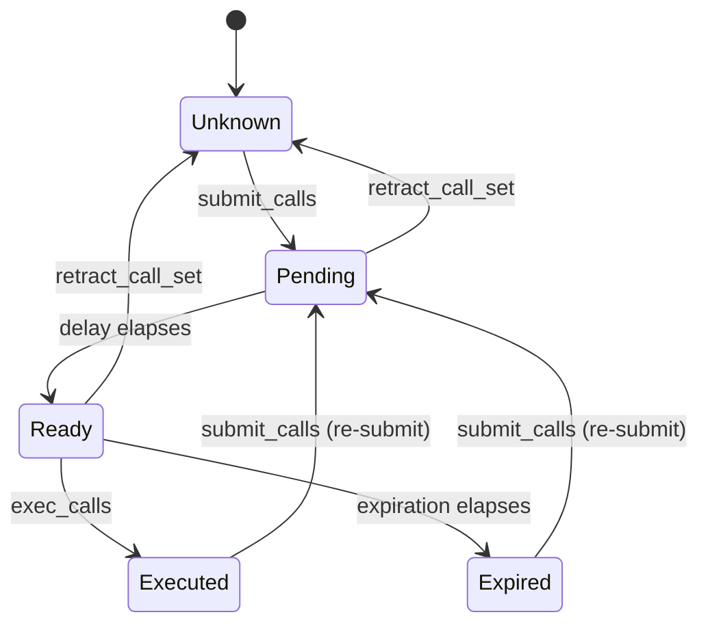
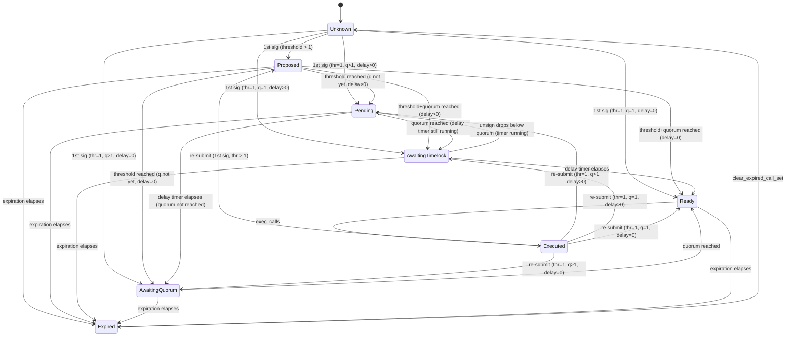

# Delayed Executor -- Specification

## 1. Overview

The `starkware_delayed_executor` package provides time-locked execution of batched contract calls on Starknet. It enforces a mandatory waiting period between when a transaction batch is proposed and when it can be executed, giving stakeholders time to review and potentially intervene.

Two contract variants are provided:

- **DelayedExecutor** -- Single-owner. One owner submits and executes call sets.
- **MultiExecutor** -- Multi-owner (multisig). Multiple owners sign call sets; execution requires a quorum of approvals and elapsed timelock.

Both share the `IDelayedExecutor` interface for common operations.

## 2. Definitions

- **Call**: A single contract invocation consisting of a target address, entry point selector, and calldata. Uses Starknet's native `starknet::account::Call` type.
- **Call Set**: An ordered batch of Calls treated as an atomic unit for submission and execution.
- **Call Set Key**: A `felt252` identifier for a call set, computed as the Poseidon hash of the serialized calls: `poseidon_hash_span(Serde::serialize(calls))`.
- **Owner Slot**: A numbered position (1-based index) in the MultiExecutor's owner set. Approvals are tracked per slot, not per address.
- **Owner Index**: The 1-based integer identifying an owner slot. Index 0 means "not an owner."
- **Quorum**: The minimum number of owner approvals required to execute a call set (MultiExecutor only).
- **Delay Start Threshold**: The number of owner approvals at which the execution delay timer begins (MultiExecutor only). Must satisfy `1 <= threshold <= quorum`.
- **Execution Delay**: The minimum time (seconds) that must elapse after the delay timer starts before a call set can be executed.
- **Execution Expiration**: The time window bounding a call set's lifetime. In DelayedExecutor, expiration is computed as `allowed_time + execution_expiration`. In MultiExecutor, expiration is set on first signature as `block_timestamp + execution_expiration`.

## 3. Constants and Bounds

| Constant | Value | Description |
|----------|-------|-------------|
| `CALL_SET_EXECUTED` | `1` | Sentinel value in `call_set_allowed_time` indicating execution completed |
| `MAX_DELAY` | `2,419,200` (28 days) | Upper bound for `execution_delay` |
| `MIN_EXPIRATION` | `3,600` (1 hour) | Lower bound for `execution_expiration` |
| `MAX_EXPIRATION` | `31,449,600` (52 weeks) | Upper bound for `execution_expiration` |
| `MAX_N_SIGNERS` | `63` | Maximum number of owners in MultiExecutor |
| `MAX_ACCEPTANCE_DELAY` | `1,209,600` (14 days) | Upper bound for ownership transfer acceptance delay |

## 4. Call Set Status

### 4.1 Status Enum

```
CallSetStatus {
    Unknown,           -- Never submitted (no signatures)
    Proposed,          -- (MultiExecutor only) Has signatures, below threshold, timer not started
    Pending,           -- Timer started, not elapsed; quorum not reached
    AwaitingTimelock,  -- (MultiExecutor only) Quorum reached, timer not elapsed
    AwaitingQuorum,    -- (MultiExecutor only) Timer elapsed, quorum not reached
    Ready,             -- Executable: timer elapsed AND quorum reached (or single-owner)
    Expired,           -- Past expiration window
    Executed,          -- Successfully executed
}
```

### 4.2 DelayedExecutor State Machine

Only a subset of states applies:



Note: A direct `Pending -> Expired` transition is impossible because the Ready window is always at least `MIN_EXPIRATION` (1 hour) wide. The call set must pass through Ready before it can expire.

### 4.3 MultiExecutor Timer Model

MultiExecutor uses two independent timers per call set. Understanding these is essential to understanding the state machine.

#### Expiration Timer (`call_set_expiration`)

- **Triggers on**: The **first signature** (`n_approvals` goes from 0 to 1), and again — once only — on the first threshold crossing.
- **Value**: `block_timestamp + execution_expiration`, measured from whichever of those two events last wrote it. Writing `T0` for the first signature and `Td` for the threshold crossing: the deadline is `T0 + E` below threshold and `Td + E` from the crossing onward.
- **Meaning**: The absolute deadline for the entire proposal. Once `block_timestamp > call_set_expiration`, the call set is Expired regardless of any other state.
- **Re-anchored once**: reaching the threshold restores the execution window that an instantly-signed call set would have had, so the window does not shrink with the time spent collecting signatures up to the threshold. It is never shortened, since `Td >= T0`, and never moves again — a dip below threshold and a re-crossing do not push it.
- **Consequence**: `execution_expiration` bounds a call set's life **per anchor**, not overall. Worst case, a call set crossing the threshold at the last admissible instant lives `2 * execution_expiration` from its first signature.
- **Minimum window**: At least `MIN_EXPIRATION` (1 hour) from the current anchor.

#### Delay Timer (`call_set_allowed_time`)

- **Triggers on**: `n_approvals` first reaching `delay_start_threshold`.
- **Value**: `block_timestamp + execution_delay` at the time threshold is first reached.
- **Meaning**: The earliest timestamp at which execution is allowed (if quorum is also met).
- **Write-once**: the delay runs once per call set. If approvals drop below threshold (via `retract_call_set`) the timer is **not** un-started, and re-reaching the threshold does **not** restart it. Only full withdrawal (`n_approvals == 0`) clears it, together with the deadline, returning the call set to `Unknown`. This is what prevents a signer sitting at the threshold boundary from postponing execution indefinitely by retracting and re-signing.
- **May never start**: If threshold is never reached before the deadline, the delay timer never starts and the call set expires in Proposed state.

#### Timeline

The following shows a typical timeline with `delay_start_threshold = 2` and `quorum_size = 3`:

```
Time ──────────────────────────────────────────────────────────────────►

│ 1st signature (T0)                                                  │
│ ├── anti-rot deadline ────────────────► T0 + E  (superseded below)   │
│                                                                     │
│         2nd signature — threshold reached (Td)                      │
│         ├── delay timer starts ──► Td + D                           │
│         └── deadline RE-ANCHORED ─────────────────────► Td + E      │
│                                    │                        │       │
│                              3rd signature (quorum)         │       │
│                                    │                        │       │
│                                    ├── executable window ───┤       │
│                                        (always E - D wide)          │
```

Key observations:
- The anti-rot deadline starts on the 1st signature and is re-anchored to the threshold crossing, which is also when the delay timer starts.
- The executable window `[Td + D, Td + E]` is always exactly `E - D` wide, independent of how long the first-to-threshold signatures took. This is why the constructor requires `execution_expiration > execution_delay`.
- **That window is shared**: collecting the remaining `quorum_size - delay_start_threshold` signatures and executing both draw on it. A call set whose quorum arrives after `Td + E` expires unexecuted — intended, and the anti-rot property working.
- If quorum is reached before the delay timer elapses: status is `AwaitingTimelock`.
- If the delay timer elapses before quorum is reached: status is `AwaitingQuorum`.
- If neither quorum nor delay timer are met: status is `Pending`.
- Execution requires **both** the delay timer to have elapsed **and** quorum to be reached (status `Ready`), while still before expiration.
- When `execution_delay == 0`, the delay timer elapses instantly when threshold is reached. This collapses intermediate states (see section 4.4).

### 4.4 State Collapse with Degenerate Configurations

Because `execution_delay` can be 0 and `n_owners` can be as low as 1 (with `quorum == threshold == 1`), a single `submit_calls` can skip intermediate states entirely.

#### First-signature transitions from Unknown (or Executed on re-submit)

The state a call set enters on its first signature depends on the configuration:

| Configuration | First-signature result | Reason |
|---|---|---|
| `threshold > 1` | **Proposed** | Below threshold; delay timer not started |
| `threshold == 1, quorum > 1, delay > 0` | **Pending** | Threshold met (timer starts), quorum not met, timer not elapsed |
| `threshold == 1, quorum > 1, delay == 0` | **AwaitingQuorum** | Threshold met, timer starts and elapses instantly, quorum not met |
| `threshold == 1, quorum == 1, delay > 0` | **AwaitingTimelock** | Threshold and quorum met, timer started but not elapsed |
| `threshold == 1, quorum == 1, delay == 0` | **Ready** | Threshold and quorum met, timer starts and elapses instantly |

#### Threshold-reached transitions from Proposed

Similarly, when approvals accumulate and reach threshold while in Proposed:

| Configuration at threshold | Result | Reason |
|---|---|---|
| `quorum not yet reached, delay > 0` | **Pending** | Timer starts, not elapsed, quorum not met |
| `quorum not yet reached, delay == 0` | **AwaitingQuorum** | Timer elapses instantly, quorum not met |
| `quorum also reached, delay > 0` | **AwaitingTimelock** | Timer starts, not elapsed, quorum met |
| `quorum also reached, delay == 0` | **Ready** | Timer elapses instantly, quorum met |

### 4.5 MultiExecutor State Machine

All 8 states apply. The active states form a matrix of two independent conditions (the delay timer and the quorum):

```
                          | Quorum NOT reached  | Quorum reached      |
--------------------------|---------------------|---------------------|
Delay timer NOT started   | Proposed            | (impossible*)       |
Delay timer NOT elapsed   | Pending             | AwaitingTimelock    |
Delay timer elapsed       | AwaitingQuorum      | Ready               |

* Since threshold <= quorum, reaching quorum always starts the delay timer.
  When delay == 0, the timer elapses instantly, so "NOT elapsed" is not reachable
  -- the state jumps directly to the "elapsed" row.
```

The expiration timer is orthogonal to this matrix: any active state (Proposed, Pending, AwaitingTimelock, AwaitingQuorum, Ready) transitions to Expired when `block_timestamp > call_set_expiration`.



Notes:
- `retract_call_set` in MultiExecutor withdraws only the caller's signature. The call set transitions backward through the *quorum* dimension as approvals decrease, but **never back to `Proposed`**: the delay timer is write-once, so once started it stays started and a dip below threshold leaves the call set in `Pending`/`AwaitingQuorum`. `Proposed` is reachable only before the threshold is first reached.
- All active states can transition to Expired because the deadline is independent of the delay timer and quorum status. Below threshold the deadline is `T0 + E`; from the threshold crossing onward it is `Td + E` (see 4.3).
- The `Executed --> *` transitions mirror the `Unknown --> *` transitions because `submit_calls` resets the executed state before applying the first signature.

## 5. Interfaces

### 5.1 IDelayedExecutor

Implemented by both `DelayedExecutor` and `MultiExecutor`.

#### `submit_calls(calls: Span<Call>, salt: felt252) -> felt252`

Registers a call set for delayed execution. The call set key is
`poseidon(serialize(calls) ++ [salt])`.

The `salt` is a caller-supplied **disambiguator, not an authorization nonce**: authorization is
re-established from scratch on every submission (full delay, full quorum), so the salt exists only so
that two content-identical batches can be in flight at once. `salt = 0` is the conventional default
and is what the governance path uses; a batch cannot be queued twice concurrently under the same
salt. Note that the off-chain proposal artifact must therefore specify `(calls, salt)`, not calls
alone.

**DelayedExecutor behavior:**
- Caller must be the owner.
- If the call set is already active (Pending or Ready), returns the key without resetting the timer (idempotent NOP).
- If the call set is Unknown, Executed, or Expired, (re-)submits it: sets `call_set_allowed_time = now + execution_delay`.
- Emits `CallSetSubmitted { call_set_key, allowed_time }`.

**MultiExecutor behavior:**
- Caller must be an owner.
- Reverts with `CALL_SET_EXPIRED` if the call set is Expired.
- Otherwise, if the caller's slot already has a signature for this call set, returns early (idempotent).
- If Executed, resets `call_set_allowed_time` to 0 to allow re-signing.
- Adds the caller's approval. Increments `n_approvals`.
- If `n_approvals` reaches `delay_start_threshold`, sets `call_set_allowed_time = now + execution_delay`.
- If this is the first signature, sets `call_set_expiration = now + execution_expiration`.
- Emits `CallSetSignaturesUpdated { call_set_key, owner_index, owner, change: SignatureAdded, n_approvals }`.

**Returns:** The call set key (`felt252`).

#### `exec_calls(calls: Span<Call>, salt: felt252)`

Executes a previously submitted call set.

**Preconditions (both):**
- Caller must be an owner.
- `get_call_set_status(key) == Ready`.
- Reverts with `CALL_SET_NOT_EXECUTABLE` otherwise.

**MultiExecutor additional precondition:**
- `n_approvals >= quorum_size`. Reverts with `QUORUM_NOT_REACHED` otherwise.
- Note: This check is logically redundant (Ready already implies quorum) but provides defense-in-depth.

**Postconditions:**
- Calls are executed via `execute_calls(calls)`.
- DelayedExecutor: `call_set_allowed_time` set to `CALL_SET_EXECUTED`.
- MultiExecutor: All approvals erased, `call_set_allowed_time` set to `CALL_SET_EXECUTED`, `call_set_expiration` set to 0.
- Emits `CallSetExecuted { call_set_key }`.

#### `retract_call_set(call_set_key: felt252)`

Cancels or withdraws approval from a call set.

**DelayedExecutor behavior:**
- Caller must be the owner.
- Call set must be Pending or Ready. Reverts with `CALL_SET_NOT_RETRACTABLE` otherwise.
- Sets `call_set_allowed_time` to 0 (Unknown).
- Emits `CallSetRetracted { call_set_key }`.

**MultiExecutor behavior:**
- Caller must be an owner.
- Caller must have signed this call set. Reverts with `NOT_SIGNED_BY_CALLER` otherwise.
- Call set must not be Expired. Reverts with `CALL_SET_EXPIRED` otherwise.
- Withdraws the caller's approval. Decrements `n_approvals`.
- If `n_approvals` drops below `delay_start_threshold`, resets `call_set_allowed_time` to 0.
- If `n_approvals` drops to 0, also clears `call_set_expiration` to 0 (returning the call set to Unknown status rather than leaving a ticking expiration).
- Emits `CallSetSignaturesUpdated { ..., change: SignatureRemoved, ... }`.

#### `get_call_set_status(call_set_key: felt252) -> CallSetStatus`

Returns the current status of a call set. Pure query, no state changes.

#### `get_call_set_allowed_time(call_set_key: felt252) -> u64`

Returns the timestamp after which the call set is allowed to be executed (time-wise).

- For active states with a started timer (Pending, AwaitingTimelock, AwaitingQuorum, Ready): returns `call_set_allowed_time`.
- For Proposed (timer not started): returns `u64::MAX`.
- For Unknown, Executed, Expired: returns `u64::MAX`.

#### `get_execution_delay() -> u64`

Returns the configured execution delay in seconds.

#### `get_execution_expiration() -> u64`

Returns the configured expiration window in seconds.

### 5.2 IMultiExecutor

Multi-owner specific functions. Only implemented by `MultiExecutor`.

#### `clear_expired_call_set(call_set_key: felt252)`

- Caller must be an owner.
- Call set must be Expired. Reverts with `NOT_EXPIRED` otherwise.
- Erases all approvals, resets `call_set_allowed_time` to 0, clears `call_set_expiration`.
- Emits `ExpiredCallSetCleared { call_set_key }`.

#### `get_call_set_expiration_time(call_set_key: felt252) -> u64`

Returns the expiration timestamp for a call set. Returns 0 if not submitted.

**Its value changes once per lifecycle.** It reports `T0 + E` below threshold and `Td + E` from the
threshold crossing onward (see 4.3). A monitor that reads it before the threshold is reached holds a
value that is later superseded, and must refresh on `CallSetTimerStarted`, which carries the new
deadline. This is the only view in the contract whose answer is not stable for a live call set.

#### `get_quorum_size() -> u32`

Returns the required number of approvals for execution.

#### `get_delay_start_threshold() -> u32`

Returns the number of approvals needed to start the delay timer.

#### `get_n_approvals(call_set_key: felt252) -> u32`

Returns the current number of approvals for a call set.

#### `has_owner_signed(call_set_key: felt252, owner: ContractAddress) -> bool`

Returns true if the owner slot currently held by `owner` has a signature on the call set.

**Important:** This is index-based, not identity-based. It resolves the address to its current owner index and checks whether that index has a signature. After ownership transfer:
- The new owner at the slot returns `true` even if they never personally signed.
- The former owner (now index 0) returns `false` even if they were the original signer.

#### `has_owner_index_signed(call_set_key: felt252, owner_index: u32) -> bool`

Returns true if the owner slot at the given 1-based index has a signature on the call set.

### 5.3 IMultiOwned

Ownership management interface. Implemented by `MultiOwnedComponent` (embedded in `MultiExecutor`).

#### `is_owner(account: ContractAddress) -> bool`

Returns true if the account is a current owner. Includes a consistency check between `owner_to_index` and `index_to_owner`.

#### `get_owner_index(account: ContractAddress) -> u32`

Returns the 1-based owner index, or 0 if not an owner.

#### `get_owner_by_index(index: u32) -> ContractAddress`

Returns the owner address at the given 1-based index. Returns zero address for invalid indices.

#### `get_n_owners() -> u32`

Returns the total number of owner slots (fixed at construction).

#### `get_owner_acceptance_delay() -> u64`

Returns the configured acceptance delay in seconds.

#### `get_pending_owner(current_owner: ContractAddress) -> ContractAddress`

Returns the pending nominee for a current owner, or zero address if none.

#### `get_acceptance_time(pending_owner: ContractAddress) -> u64`

Returns the timestamp when a pending owner can accept ownership.

#### `transfer_ownership(new_owner: ContractAddress)`

- Caller must be an owner.
- `new_owner` must not already be an owner. Reverts with `ALREADY_OWNER`.
- `new_owner` must not be pending for any owner. Reverts with `ALREADY_PENDING`.
- Clears any existing pending nomination for the caller.
- If `new_owner` is non-zero: sets up nomination, records `acceptance_time = now + owner_acceptance_delay`.
- If `new_owner` is zero: only clears the existing nomination.
- Emits `OwnershipNominated { current_owner, new_owner }` (for non-zero) or `OwnershipNominationCleared` (if clearing previous).

#### `accept_ownership()`

- Caller must be a pending nominee. Reverts with `NOT_PENDING_OWNER`.
- The replaced owner must still be an owner (consistency check).
- `block_timestamp >= acceptance_time`. Reverts with `CANNOT_ACCEPT_YET`.
- Replaces the old owner at the same index.
- Emits `OwnershipAccepted { old_owner, new_owner }` and `OwnershipRevoked { revoked_owner }`.

## 6. Constructor Constraints

### 6.1 DelayedExecutor

```
constructor(owner, execution_delay, execution_expiration)
```

| Parameter | Constraint | Error |
|-----------|-----------|-------|
| `execution_delay` | `<= MAX_DELAY` (28 days) | `DELAY_TOO_LONG` |
| `execution_expiration` | `>= MIN_EXPIRATION` (1 hour) | `EXPIRATION_TOO_SHORT` |
| `execution_expiration` | `<= MAX_EXPIRATION` (52 weeks) | `EXPIRATION_TOO_LONG` |

### 6.2 MultiExecutor

```
constructor(owners, quorum_size, delay_start_threshold, owner_acceptance_delay, execution_delay, execution_expiration)
```

| Parameter | Constraint | Error |
|-----------|-----------|-------|
| `quorum_size` | `> 0` | `EMPTY_QUORUM` |
| `quorum_size` | `<= len(owners)` | `QUORUM_TOO_BIG` |
| `delay_start_threshold` | `> 0 AND <= quorum_size` | `ILLEGAL_THRESHOLD` |
| `execution_delay` | `<= MAX_DELAY` | `DELAY_TOO_LONG` |
| `execution_expiration` | `>= MIN_EXPIRATION` | `EXPIRATION_TOO_SHORT` |
| `execution_expiration` | `<= MAX_EXPIRATION` | `EXPIRATION_TOO_LONG` |
| `len(owners)` | `> 0` | `NO_OWNERS` |
| `len(owners)` | `<= MAX_N_SIGNERS` (63) | `TOO_MANY_SIGNERS` |
| each owner | `!= zero address` | `ZERO_OWNER_ADDRESS` |
| each owner | unique | `DUPLICATE_OWNER` |
| `owner_acceptance_delay` | `<= MAX_ACCEPTANCE_DELAY` (14 days) | `ACCEPTANCE_DELAY_TOO_LONG` |

## 7. Invariants

The following properties must hold at all times after construction:

1. **`call_set_allowed_time` encoding**: For any `call_set_key`:
   - `0` means not submitted (or cleared).
   - `1` (`CALL_SET_EXECUTED`) means executed.
   - `> 1` is a valid future/past timestamp indicating when execution becomes eligible.

2. **Approval count consistency** (MultiExecutor): `call_set_n_approvals[key]` equals the count of indices `i` in `[1..n_owners]` where `call_set_approvers[(key, i)] == true`.

3. **Owner map consistency**: For all addresses `a` and indices `i`:
   - If `owner_to_index[a] == i` and `i > 0`, then `index_to_owner[i] == a`.
   - If `index_to_owner[i] == a` and `a != 0`, then `owner_to_index[a] == i`.

4. **Parameter ordering**: `1 <= delay_start_threshold <= quorum_size <= n_owners <= MAX_N_SIGNERS`, and `execution_delay < execution_expiration`. The latter is exactly the condition for the executable window `E - D` to be positive, i.e. for any call set to be executable at all.

5. **Ready implies quorum** (MultiExecutor): If `get_call_set_status(key) == Ready`, then `call_set_n_approvals[key] >= quorum_size`. The explicit quorum check in `exec_calls` is a belt-and-suspenders defense.

6. **Expiration written at most twice**: `call_set_expiration[key]` is set when `n_approvals` goes from 0 to 1 (`T0 + E`), and re-anchored exactly once when `n_approvals` first reaches `delay_start_threshold` (`Td + E`). It is never written again until the call set is cleared, and is never shortened.

7. **Delay timer write-once**: `call_set_allowed_time[key]` is set when `n_approvals` first reaches `delay_start_threshold` and is never restarted. Dropping below the threshold does not un-start it; only `n_approvals == 0` clears it, together with the deadline.

7b. **Timer implies threshold was reached**: if `call_set_allowed_time[key] == 0` then `n_approvals[key] < delay_start_threshold`. Since `delay_start_threshold <= quorum_size`, a call set at or above quorum always has a started timer, so no call set can be stuck below `Ready` for want of a timer nobody can start.

8. **Owner count immutability**: `n_owners` never changes after construction.

## 8. Events

### 8.1 DelayedExecutor Events

| Event | Fields | Emitted When |
|-------|--------|-------------|
| `CallSetSubmitted` | `call_set_key` (key), `allowed_time` | A call set is newly submitted or re-submitted |
| `CallSetExecuted` | `call_set_key` (key) | A call set is executed |
| `CallSetRetracted` | `call_set_key` (key) | A call set is cancelled |
| OZ Ownable events | (standard) | Ownership transfers |

### 8.2 MultiExecutor Events

| Event | Fields | Emitted When |
|-------|--------|-------------|
| `CallSetSignaturesUpdated` | `call_set_key` (key), `owner_index`, `owner`, `change` (enum), `n_approvals` | An owner signs or unsigns a call set. `n_approvals` is the count *at emission* |
| `CallSetTimerStarted` | `call_set_key` (key), `allowed_time`, `expiration` | The delay timer starts, i.e. the first threshold crossing. At most once per call-set lifecycle, and the only moment `call_set_expiration` changes |
| `CallSetExecuted` | `call_set_key` (key) | A call set is executed |
| `ExpiredCallSetCleared` | `call_set_key` (key) | An expired call set is cleared |

### 8.3 MultiOwned Events

| Event | Fields | Emitted When |
|-------|--------|-------------|
| `OwnershipNominated` | `current_owner` (key), `new_owner` (key) | An owner nominates a replacement |
| `OwnershipNominationCleared` | `owner` (key), `revoked` (key) | A pending nomination is cleared |
| `OwnershipAccepted` | `old_owner` (key), `new_owner` (key) | A nominee accepts ownership |
| `OwnershipRevoked` | `revoked_owner` (key) | An owner is replaced |

## 9. Error Codes

| Error | Contract(s) | Condition |
|-------|------------|-----------|
| `DELAY_TOO_LONG` | Both | `execution_delay > MAX_DELAY` |
| `EXPIRATION_TOO_SHORT` | Both | `execution_expiration < MIN_EXPIRATION` |
| `EXPIRATION_TOO_LONG` | Both | `execution_expiration > MAX_EXPIRATION` |
| `EXPIRATION_BELOW_DELAY` | MultiExecutor | `execution_expiration <= execution_delay` (the executable window would be empty) |
| `CALL_SET_NOT_RETRACTABLE` | DelayedExecutor | `retract_call_set` called on non-Pending/Ready call set |
| `CALL_SET_NOT_EXECUTABLE` | Both | `exec_calls` called when status != Ready |
| `TOO_MANY_SIGNERS` | MultiExecutor | `len(owners) > MAX_N_SIGNERS` |
| `NO_OWNERS` | MultiExecutor | `len(owners) == 0` |
| `ZERO_OWNER_ADDRESS` | MultiExecutor | Zero address in owner list |
| `DUPLICATE_OWNER` | MultiExecutor | Same address appears twice in owner list |
| `ACCEPTANCE_DELAY_TOO_LONG` | MultiExecutor | `owner_acceptance_delay > MAX_ACCEPTANCE_DELAY` |
| `ONLY_OWNER` | MultiExecutor | Caller is not an owner |
| `ALREADY_OWNER` | MultiExecutor | `transfer_ownership` to existing owner |
| `ALREADY_PENDING` | MultiExecutor | Nominee is already pending for another owner |
| `NOT_PENDING_OWNER` | MultiExecutor | `accept_ownership` caller has no pending nomination |
| `CANNOT_ACCEPT_YET` | MultiExecutor | `accept_ownership` before acceptance delay elapsed |
| `EMPTY_QUORUM` | MultiExecutor | `quorum_size == 0` |
| `QUORUM_TOO_BIG` | MultiExecutor | `quorum_size > len(owners)` |
| `ILLEGAL_THRESHOLD` | MultiExecutor | `delay_start_threshold == 0` or `> quorum_size` |
| `CALL_SET_EXPIRED` | MultiExecutor | Signing or unsigning an expired call set |
| `NOT_SIGNED_BY_CALLER` | MultiExecutor | `retract_call_set` when caller has not signed |
| `NOT_EXPIRED` | MultiExecutor | `clear_expired_call_set` on non-expired call set |
| `QUORUM_NOT_REACHED` | MultiExecutor | `exec_calls` when `n_approvals < quorum_size` |
| `UNREACHABLE_STATE` | DelayedExecutor | `submit_calls` observed a MultiExecutor-only status (defensive; should never trigger) |
| `OWNER_MAP_INCONSISTENCY` | MultiExecutor | `owner_to_index`/`index_to_owner` disagree (invariant violation) |
| `INCONSISTENT_REPLACEMENT` | MultiExecutor | Pending nomination pointers disagree (invariant violation) |
| `REPLACED_NOT_OWNER` | MultiExecutor | Owner being replaced is no longer an owner (invariant violation) |
| `INVALID_OWNER_INDEX` | MultiExecutor | Owner index is zero during replacement (invariant violation) |

## 10. Limitations

- **Immutable parameters**: `execution_delay`, `execution_expiration`, `quorum_size`,
  `delay_start_threshold`, and `owner_acceptance_delay` are fixed at construction and cannot be
  updated on-chain. Changing them requires deploying a new contract.
- **Lifetime is bounded per anchor, not per call set**: reaching the threshold re-anchors the
  deadline, so a call set that crosses the threshold at the last admissible instant lives up to
  `2 * execution_expiration` from its first signature (see 4.3).
- **The post-threshold window is shared**: collecting the remaining
  `quorum_size - delay_start_threshold` signatures and executing both draw on the same `E - D`
  window. A call set whose quorum arrives after `Td + E` expires unexecuted. This is intended.
- **A late threshold crossing extends the deadline**: a signer pivotal at the threshold can withhold
  until just before `T0 + E` and then cross, which both starts the (non-restartable) delay timer and
  pushes the deadline to nearly `T0 + 2E`. It costs them their own signature, and the remaining
  signers recover by retracting to zero, which clears both timers.
- **One in-flight instance per `(calls, salt)` pair**: two content-identical batches need distinct
  salts to be queued concurrently. `salt = 0` is the conventional default.
- **`delay_start_threshold == quorum_size == n_owners`** leaves no spare signature, so every signer
  sits on the threshold boundary.
- **Fixed owner count**: The number of owner slots (`n_owners`) is fixed at construction.
  Owners can be replaced but not added or removed.
- **Approval erasure cost**: `_erase_approvals` iterates over all `n_owners` slots (O(n)) per
  execution or clearing. Bounded by `MAX_N_SIGNERS = 63`.
- **No reentrancy guard**: `exec_calls` makes external calls after updating state. Safety relies
  on the checks-effects-interactions pattern (state is updated before the external calls).
